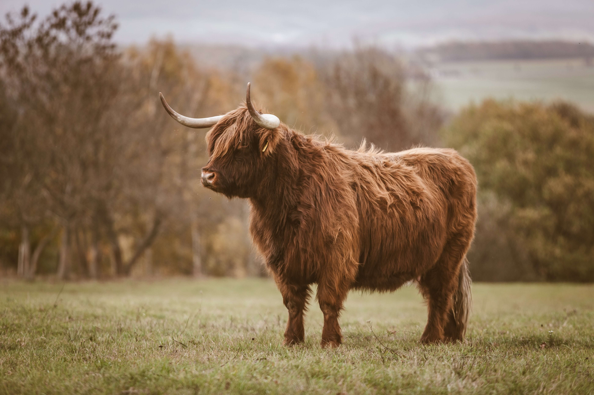

# Cow

*Picture by [Quaritsch Photography](https://unsplash.com/@quaritsch) on Unsplash, via https://unsplash.com/photos/1_6rJHQ2Gmw*

# NixOS Configuration
This is a bare minimum nix configuration for koumakan.

I'm still very, very new to Nix and its ecosystem so pointers to better
way of doing things are very much appreciated.

## docs
documentation and extra tips can be found [here](docs/)

couldn't find what you needed? suffer with me! see the
[How 2 Nix section in this repo.](https://github.com/hlissner/dotfiles#frequently-asked-questions)

✓✓✓✓✓✓✓✓✓✓✓✓✓✓✓✓✓✓✓✓✓✓✓✓✓✓✓✓✓✓✓✓✓✓✓✓✓✓✓✓✓✓✓✓✓✓

## Todo
See ./TODO.md
